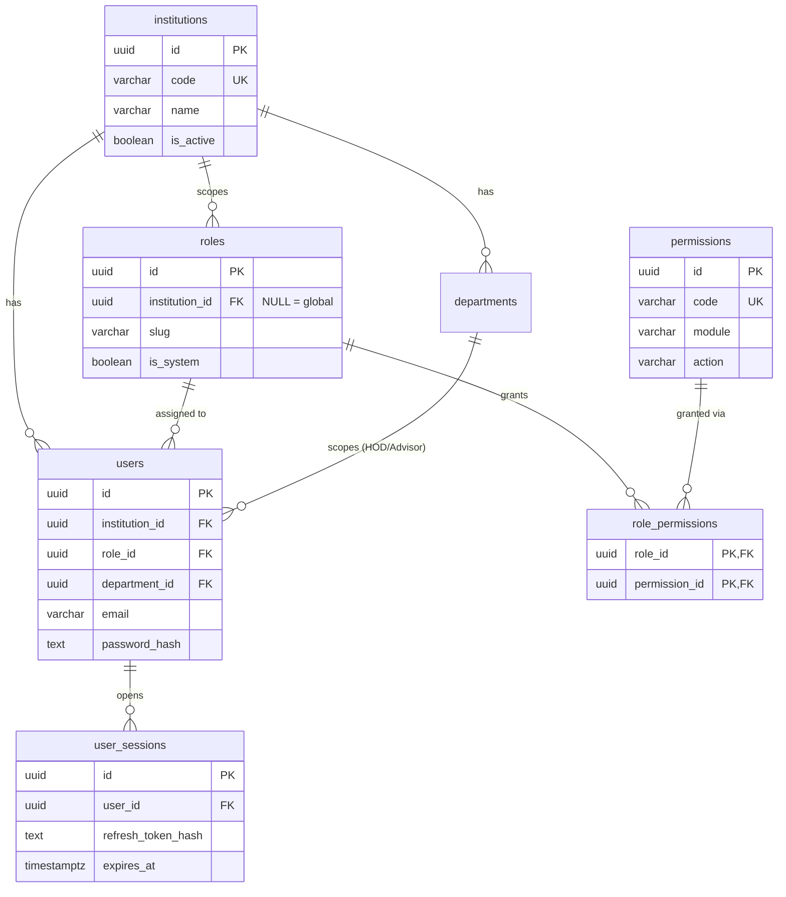
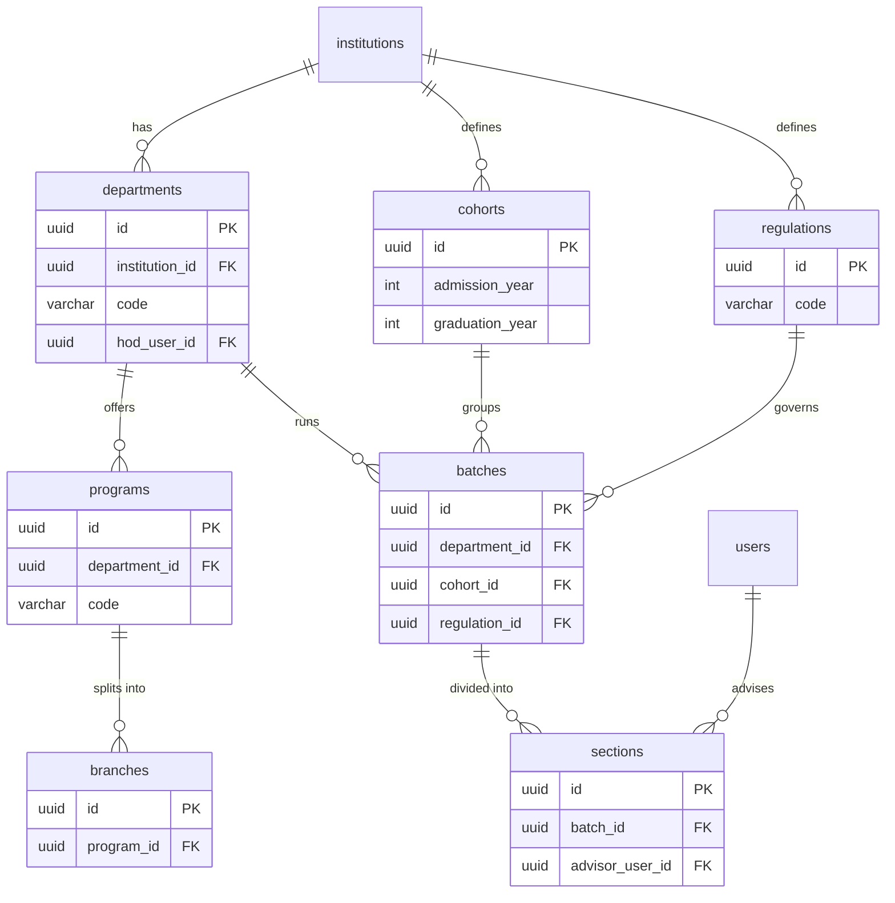
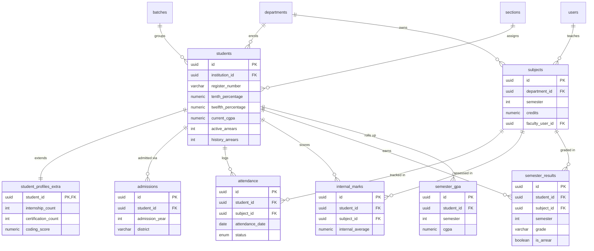
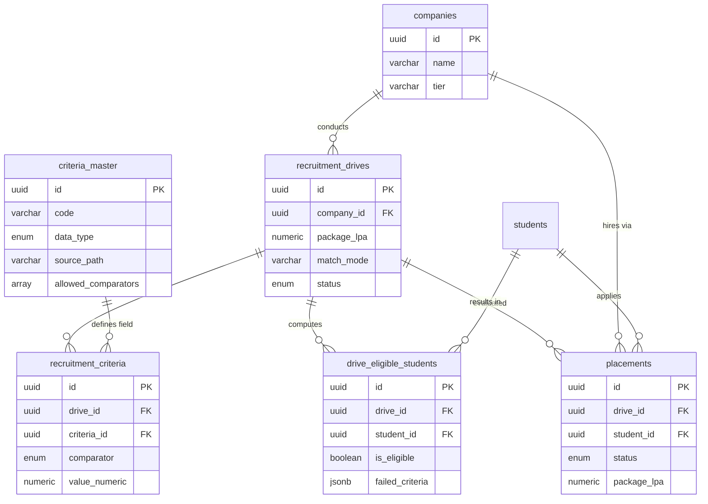
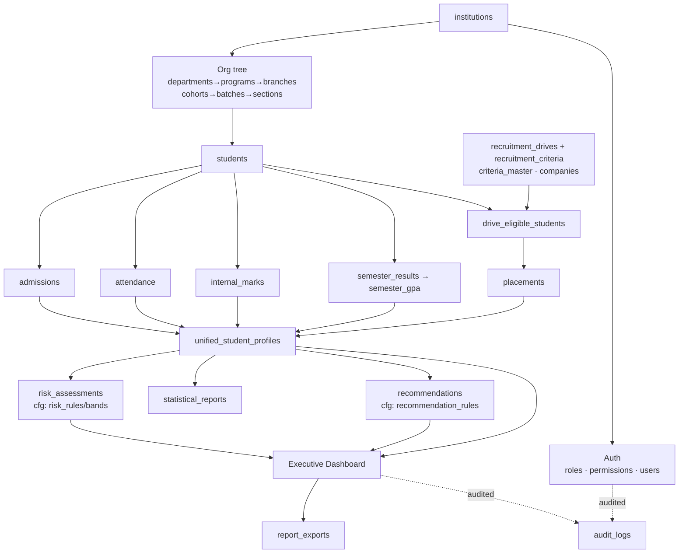

# Phase 2 — ER Diagram & Data Dictionary
**Institutional Insights Dashboard** · Admission → Academics → Placement Analytics

> Render the Mermaid blocks in any Mermaid-aware viewer (VS Code Markdown Preview Mermaid, GitHub, mermaid.live).
> The model is split into subject-area diagrams for readability, followed by a master relationship map and the field-level data dictionary.

---

## 1. Tenancy & Identity (Modules 1, 20)

---

## 2. Organisation Hierarchy (Module 2)

---

## 3. Student → Academics (Modules 3, 4, 5, 6, 7, 8)

---

## 4. Placement Funnel (Modules 9, 10, 11)

---

## 5. Analytics, Risk, Recommendations, Reporting (Modules 12–19)

```mermaid
erDiagram
    students            ||--|| unified_student_profiles : "snapshot of"
    students            ||--o{ risk_assessments         : "scored"
    risk_rule_sets      ||--o{ risk_rules               : "contains"
    risk_rule_sets      ||--o{ risk_bands               : "bands"
    risk_rule_sets      ||--o{ risk_assessments         : "uses"
    recommendation_rules||--o{ recommendations          : "fires"
    students            ||--o{ recommendations          : "targets"
    departments         ||--o{ recommendations          : "targets"
    institutions        ||--o{ statistical_reports      : "scoped"
    institutions        ||--o{ report_exports           : "scoped"
    users               ||--o{ report_exports           : "requests"
    institutions        ||--o{ audit_logs               : "scoped"
    users               ||--o{ audit_logs               : "acts"

    unified_student_profiles { uuid student_id PK,FK
        numeric current_cgpa
        numeric avg_attendance_pct
        boolean is_placed
        enum risk_level }
    risk_rule_sets   { uuid id PK
        varchar name }
    risk_rules       { uuid id PK
        uuid rule_set_id FK
        varchar metric
        enum comparator
        numeric threshold_num
        numeric weight }
    risk_bands       { uuid id PK
        uuid rule_set_id FK
        enum level
        numeric min_score
        numeric max_score }
    risk_assessments { uuid id PK
        uuid student_id FK
        enum risk_level
        numeric risk_score
        jsonb factors }
    statistical_reports { uuid id PK
        varchar test_type
        numeric p_value }
    recommendation_rules { uuid id PK
        jsonb conditions
        text action_text }
    recommendations  { uuid id PK
        uuid rule_id FK
        text action_text
        varchar status }
    report_exports   { uuid id PK
        varchar report_type
        enum format
        enum status }
    audit_logs       { bigserial id PK
        uuid user_id FK
        enum action
        jsonb detail }
```

---

## 6. Master Relationship Map (high level)

---

## 7. Data Dictionary (field-level)

Conventions: PK = primary key · FK = foreign key · UK = unique · NN = NOT NULL.
All `*_id` columns are `UUID` unless stated. All timestamps are `TIMESTAMPTZ` (UTC).

### institutions
| Column | Type | Key/Constraint | Description |
|---|---|---|---|
| id | UUID | PK | Tenant identifier |
| code | VARCHAR(20) | UK, NN | Short institution code |
| name | VARCHAR(255) | NN | Display name |
| is_active | BOOLEAN | NN, def TRUE | Tenant enabled flag |

### roles
| Column | Type | Key/Constraint | Description |
|---|---|---|---|
| id | UUID | PK | |
| institution_id | UUID | FK→institutions | NULL = global role (Super Admin) |
| slug | VARCHAR(80) | NN, UK(inst,slug) | Machine name (super_admin, hod…) |
| is_system | BOOLEAN | def FALSE | Protects built-in roles from deletion |

### permissions
| Column | Type | Key/Constraint | Description |
|---|---|---|---|
| id | UUID | PK | |
| code | VARCHAR(120) | UK, NN | `module.action` (e.g. student.create) |
| module / action | VARCHAR | NN | Decomposed for grouping in UI |

### role_permissions
| Column | Type | Key/Constraint | Description |
|---|---|---|---|
| role_id | UUID | PK, FK→roles | Composite PK with permission_id |
| permission_id | UUID | PK, FK→permissions | Grant link |

### users
| Column | Type | Key/Constraint | Description |
|---|---|---|---|
| id | UUID | PK | |
| institution_id | UUID | FK→institutions | NULL only for Super Admin |
| role_id | UUID | FK→roles, NN | One role per user |
| department_id | UUID | FK→departments | Scopes HOD / Faculty Advisor |
| email | VARCHAR(255) | NN, UK(inst,email) | Login id |
| password_hash | TEXT | NN | bcrypt/argon2 hash |
| password_reset_token / _expires_at | TEXT / TS | | Forgot-password flow |
| last_login_at | TS | | Audited on login |
| deleted_at | TS | | Soft delete |

### user_sessions
| Column | Type | Key/Constraint | Description |
|---|---|---|---|
| id | UUID | PK | |
| user_id | UUID | FK→users, NN | |
| refresh_token_hash | TEXT | NN | Server-side session control |
| ip_address | INET | | Captured for audit |
| expires_at / revoked_at | TS | | Lifecycle |

### departments
| Column | Type | Key/Constraint | Description |
|---|---|---|---|
| id | UUID | PK | |
| institution_id | UUID | FK, NN | |
| code | VARCHAR(20) | NN, UK(inst,code) | CSE, ECE, MECH… |
| hod_user_id | UUID | FK→users | Department head |

### programs / branches / regulations / cohorts / batches / sections
| Table | Key columns | Notes |
|---|---|---|
| programs | department_id FK, code, level, duration_years | UG/PG program under a department |
| branches | program_id FK, code | Specialisation within a program |
| regulations | code (R2021…), effective_year | Curriculum regulation version |
| cohorts | admission_year, graduation_year | Year-group ("2021-2025") |
| batches | department_id, cohort_id, regulation_id, current_semester | Running class instance |
| sections | batch_id, name (A/B/C), advisor_user_id | Section + faculty advisor |

### students
| Column | Type | Key/Constraint | Description |
|---|---|---|---|
| id | UUID | PK | |
| institution_id | UUID | FK, NN | |
| register_number | VARCHAR(40) | NN, UK(inst,reg) | Unique roll number |
| name / gender / date_of_birth / email / mobile | | | Personal info (Module 3) |
| tenth_/twelfth_/diploma_percentage | NUMERIC(5,2) | | Entry qualifications |
| admission_type | ENUM | | COUNSELING/MANAGEMENT/LATERAL_ENTRY… |
| cutoff_mark | NUMERIC(6,2) | | Admission cutoff |
| department_id / batch_id / section_id / regulation_id | UUID | FK | Placement in org tree |
| current_cgpa | NUMERIC(4,2) | | Rolling snapshot (job-refreshed) |
| active_arrears / history_arrears | INT | def 0 | Rolling snapshot |
| status | VARCHAR(20) | def ACTIVE | ACTIVE/ALUMNI/DROPPED |
| deleted_at | TS | | Soft delete |

### student_profiles_extra
| Column | Type | Description |
|---|---|---|
| student_id | UUID PK,FK | 1:1 with students |
| internship_count / certification_count / hackathon_count | INT | Employability signals |
| coding_score | NUMERIC(7,2) | External coding-test score |

### admissions
| Column | Type | Description |
|---|---|---|
| id | UUID PK | |
| student_id / department_id / cohort_id | UUID FK | Links |
| admission_year | INT NN | |
| admission_type | ENUM | |
| is_management_quota / is_counseling_quota / is_lateral_entry | BOOLEAN | Quota flags |
| cutoff_mark | NUMERIC(6,2) | |
| school_name / district / state | VARCHAR | Source-school analytics |

### subjects
| Column | Type | Description |
|---|---|---|
| id | UUID PK | |
| department_id | UUID FK NN | Owning department |
| regulation_id | UUID FK | Curriculum version |
| code / name | VARCHAR | UK(inst,code,regulation) |
| credits | NUMERIC(3,1) | |
| semester | INT NN | |
| faculty_user_id | UUID FK→users | Assigned faculty |

### attendance
| Column | Type | Description |
|---|---|---|
| id | UUID PK | |
| student_id / subject_id | UUID FK NN | |
| attendance_date | DATE NN | UK(student,subject,date,period) |
| status | ENUM | PRESENT/ABSENT/OD/LEAVE |
| period | INT | Optional period number |
| marked_by | UUID FK→users | |

### internal_marks
| Column | Type | Description |
|---|---|---|
| id | UUID PK | |
| student_id / subject_id | UUID FK NN | UK(student,subject,semester) |
| semester | INT | |
| test1 / test2 / assignment | NUMERIC(5,2) | Component marks |
| internal_average | NUMERIC(5,2) | Computed, stored for reporting |
| max_marks | NUMERIC(5,2) def 100 | |

### semester_results
| Column | Type | Description |
|---|---|---|
| id | UUID PK | |
| student_id | UUID FK NN | UK(student,subject,semester) |
| subject_id | UUID FK | |
| semester | INT NN | |
| grade / grade_points | VARCHAR / NUMERIC | O, A+, … U |
| result | ENUM | PASS/FAIL/ABSENT/WITHHELD |
| credits_earned | NUMERIC(4,1) | |
| is_arrear | BOOLEAN | Drives arrear analytics |

### semester_gpa
| Column | Type | Description |
|---|---|---|
| id | UUID PK | |
| student_id | UUID FK NN | UK(student,semester) |
| semester | INT NN | |
| gpa / cgpa | NUMERIC(4,2) | Per-semester roll-up |
| credits_registered / credits_earned | NUMERIC(5,1) | |

### companies
| Column | Type | Description |
|---|---|---|
| id | UUID PK | UK(inst,name) |
| name / industry / location / website | VARCHAR | |
| tier | VARCHAR(20) | Configurable label (TIER1…), not enforced |

### criteria_master
| Column | Type | Description |
|---|---|---|
| id | UUID PK | |
| institution_id | UUID FK | NULL = global catalogue item |
| code | VARCHAR(60) | UK(inst,code) — CGPA, TENTH_PCT… |
| data_type | ENUM | NUMERIC/INTEGER/BOOLEAN/STRING/ENUM |
| source_path | VARCHAR(120) | Resolver key into unified profile |
| allowed_comparators | comparator_t[] | Which operators are valid |
| enum_options | JSONB | Choices for ENUM/STRING IN-lists |

### recruitment_drives
| Column | Type | Description |
|---|---|---|
| id | UUID PK | |
| company_id | UUID FK NN | |
| title / role | VARCHAR | |
| drive_date | DATE | |
| package_lpa | NUMERIC(8,2) | Offered CTC |
| is_internship | BOOLEAN | |
| match_mode | VARCHAR(10) | ALL (AND) / ANY (OR) |
| status | ENUM | DRAFT…COMPLETED/CANCELLED |

### recruitment_criteria
| Column | Type | Description |
|---|---|---|
| id | UUID PK | |
| drive_id | UUID FK NN | |
| criteria_id | UUID FK→criteria_master | The field being tested |
| comparator | ENUM | GTE/LTE/EQ/IN/BETWEEN… |
| value_numeric / value_text / value_json | | Threshold payload by type |

### drive_eligible_students
| Column | Type | Description |
|---|---|---|
| id | UUID PK | UK(drive,student) |
| drive_id / student_id | UUID FK NN | |
| is_eligible | BOOLEAN NN | Computed result |
| failed_criteria | JSONB | Explanation of failed rules |
| computed_at | TS | Last recompute time |

### placements
| Column | Type | Description |
|---|---|---|
| id | UUID PK | UK(drive,student) |
| drive_id / company_id / student_id | UUID FK NN | |
| status | ENUM | ELIGIBLE→APPLIED→ATTENDED→SELECTED/REJECTED |
| applied / attended / selected | BOOLEAN | Funnel flags |
| package_lpa | NUMERIC(8,2) | Final offered CTC |
| is_internship | BOOLEAN | |
| offer_date | DATE | |

### unified_student_profiles (read model)
| Column | Type | Description |
|---|---|---|
| student_id | UUID PK,FK | 1:1 snapshot of a student |
| admission_year / admission_type / cutoff_mark / *_percentage | | Admission slice |
| current_cgpa / active_arrears / history_arrears / avg_attendance_pct / avg_internal | | Academic slice |
| internship_count / certification_count / hackathon_count / coding_score | | Employability slice |
| is_placed / highest_package_lpa / offers_count | | Placement slice |
| risk_level / risk_score | | Denormalised latest risk |
| refreshed_at | TS | Last analytics-job refresh |

### risk_rule_sets / risk_rules / risk_bands / risk_assessments
| Table | Key columns | Notes |
|---|---|---|
| risk_rule_sets | name, is_active | Versioned model per institution |
| risk_rules | category, metric, comparator, threshold_num, weight, message_template | One configurable flag rule |
| risk_bands | level, min_score, max_score | Score→LOW/MEDIUM/HIGH banding |
| risk_assessments | student_id, risk_level, risk_score, factors(JSONB) | Output + explanation |

### statistical_reports
| Column | Type | Description |
|---|---|---|
| id | UUID PK | |
| test_type | VARCHAR(40) | PEARSON/SPEARMAN/TTEST/ANOVA |
| variables / scope | JSONB | Inputs + filters |
| statistic / p_value / effect_size / sample_size | | Results |
| interpretation | TEXT | Human-readable conclusion |
| raw_output | JSONB | Full Python service payload |

### recommendation_rules / recommendations
| Table | Key columns | Notes |
|---|---|---|
| recommendation_rules | conditions(JSONB), logic(ALL/ANY), action_text, scope_level, priority | Authored from UI |
| recommendations | rule_id, student_id/department_id, action_text, rationale(JSONB), status | Generated outputs |

### report_exports
| Column | Type | Description |
|---|---|---|
| id | UUID PK | |
| report_type | VARCHAR(60) | ADMISSION/ACADEMIC/PLACEMENT/RISK/STUDENT/DEPARTMENT |
| format | ENUM | PDF / EXCEL |
| params | JSONB | Filters applied |
| status | ENUM | QUEUED→PROCESSING→READY/FAILED |
| file_path | TEXT | Generated artifact location |

### audit_logs
| Column | Type | Description |
|---|---|---|
| id | BIGSERIAL | PK (high-volume table) |
| institution_id / user_id | UUID FK | Actor context |
| action | ENUM | LOGIN/LOGOUT/CREATE/UPDATE/DELETE/UPLOAD/DOWNLOAD/EXPORT |
| entity / entity_id | VARCHAR | Affected record |
| detail | JSONB | before/after, filename, report id |
| ip_address | INET | |
| created_at | TS | |

---

## 8. Cardinality summary
- `institutions 1—N` everything (tenant root).
- `roles 1—N users`; `roles N—N permissions` via `role_permissions`.
- `departments 1—N programs 1—N branches`; `cohorts 1—N batches 1—N sections`.
- `students 1—1 student_profiles_extra`; `students 1—1 unified_student_profiles`.
- `students 1—N attendance / internal_marks / semester_results / admissions`.
- `recruitment_drives 1—N recruitment_criteria` (each referencing one `criteria_master`).
- `recruitment_drives N—N students` materialised through `drive_eligible_students` and `placements`.
- `risk_rule_sets 1—N risk_rules / risk_bands`; `students 1—N risk_assessments`.
